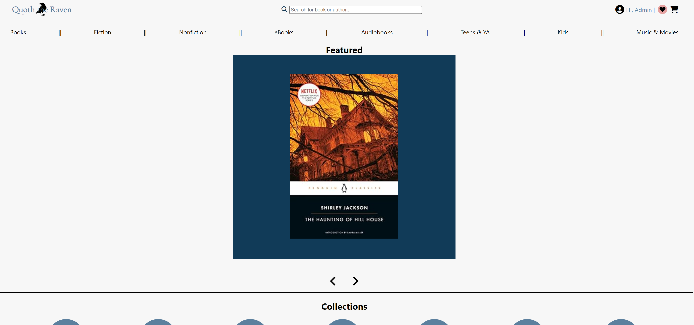
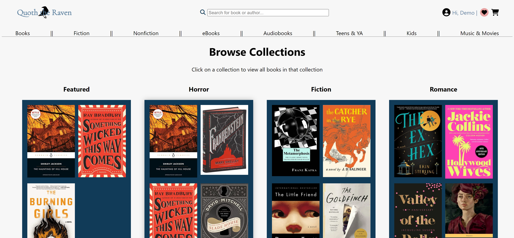
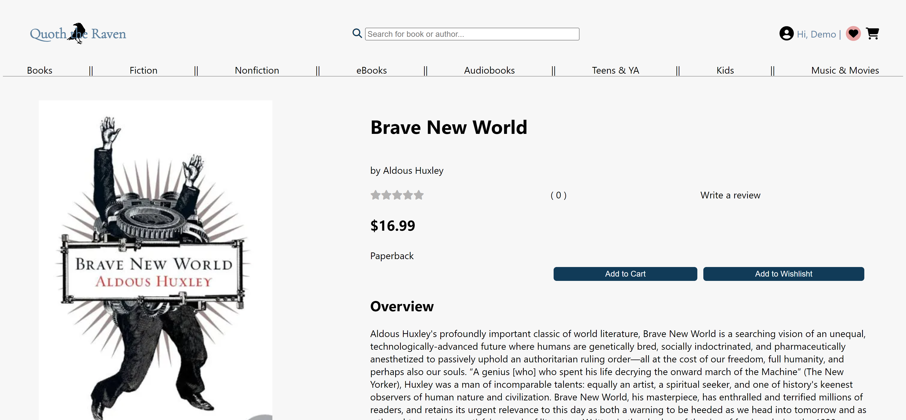
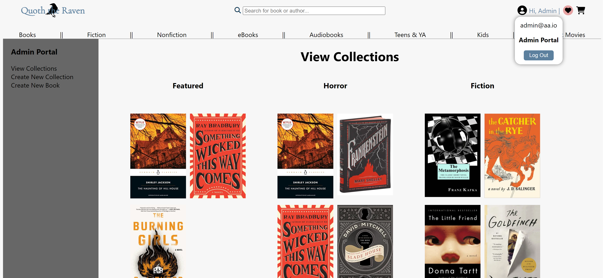

# Quoth the Raven

Quoth the Raven is an e-commerce app inspired by Barnes and Noble and other book sellers.

It allows an admin user to:

- Create books and collections and manage them both through an admin portal and directly from the book detail and collections pages

It allows any user to:

- Browse through collections and from the book detail, and if logged in, that user can also add that book to a wishlist
- Create and manage their wishlists, and while viewing books in their wishlist, view the title, author, and description of the book.
- Search for any book by name in the navigation's search bar

## Live Link

Live Link to [Quoth the Raven](https://jhalton-quoth-the-raven.onrender.com)

## Technologies used

- JavaScript
- Python
- Flask
- Flask-SQLAlchemy
- React
- Redux
- CSS
- HTML

## Wiki

Click here to view the [wiki](https://github.com/jhalton/quoth-the-raven/wiki)

## Screenshots

### Home Page

### Browse Collections

### Book Detail

### Admin Portal

